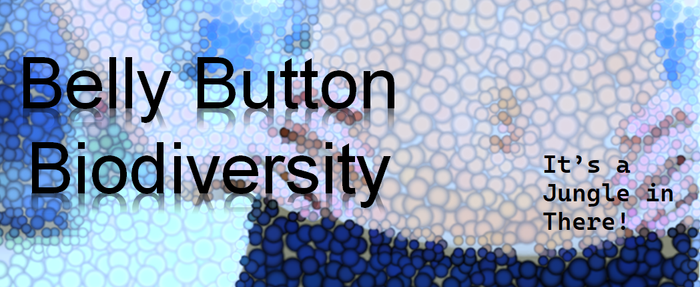
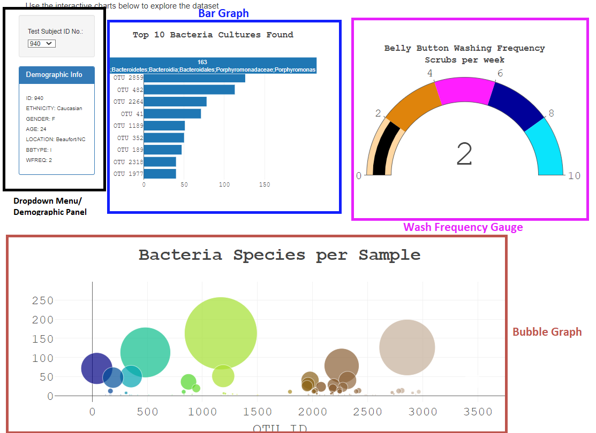

  

# Belly Button Biodiversity
The belly button is one of the habitats closest to us, and yet it remains relatively unexplored. We analyzed bacteria from the belly buttons of humans from population sampled within a science project.
## Overview:

A team of scientists launched the Belly Button Biodiversity Project to find out. For this project, people wiped cotton swabs in or on their belly buttons. From the first group they collected 66 samples from participants. The research team discovered that belly buttons are very diverse habitats! In total, they discovered 2,368 different species. More than half of those may be new to science.

## Results:
The dashboard consists of four major components.

  

## Summary
The Dashboard has been deployed to Github.io pages.

[Belly Button Biodiversity](https://rafajos20.github.io/Belly_Button_Biodiversity/)

### Customizations:
* Image loaded into jumbotron.
* Text paragraph added.
* Color scale customized on gauge.
* Zoom function added to bubble graph.
* Plotly chart fonts customized.

